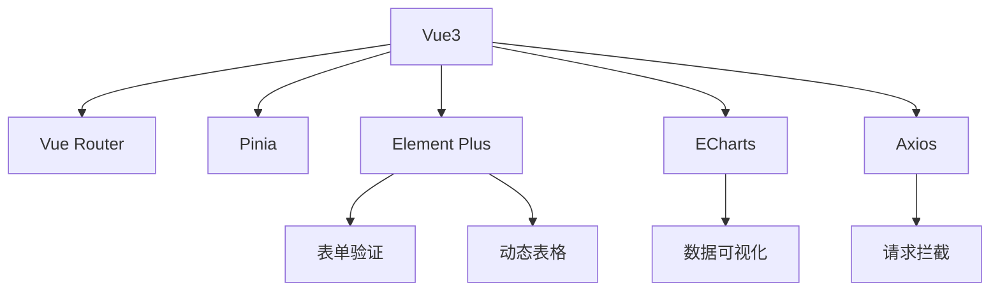
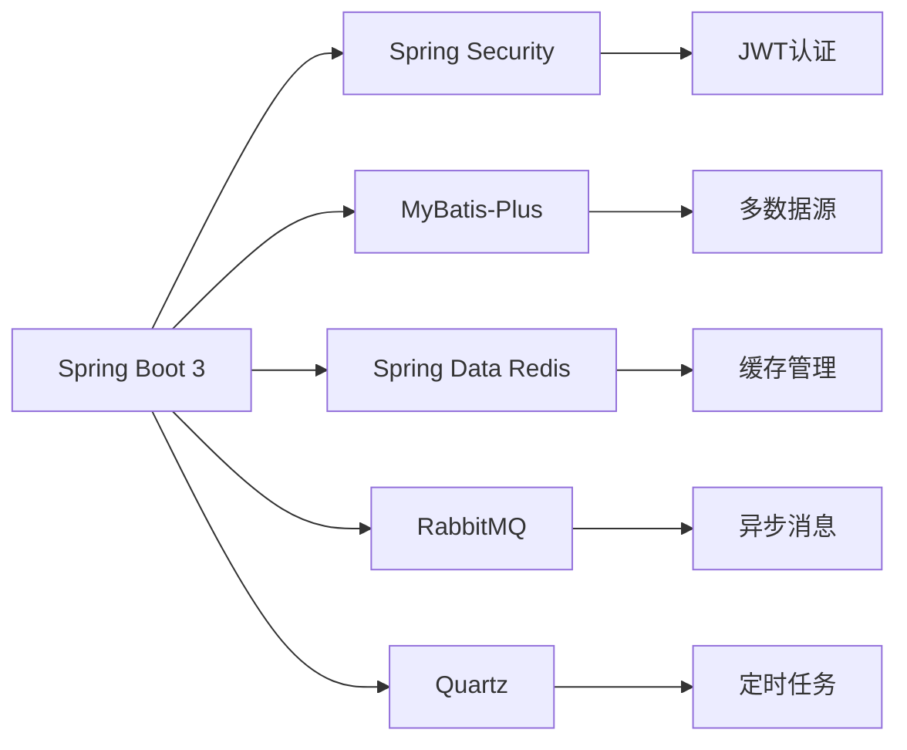

```markdown
# 电子贺卡管理系统 - Graduation eCard Management System (GEMS)


一个基于Spring Boot 3 + Vue3的全栈式电子贺卡管理系统，专为教育机构设计，实现毕业生生日祝福自动化发送与管理。

## 📌 项目概览

### 核心功能矩阵
| 模块                | 功能点                                                                 |
|---------------------|----------------------------------------------------------------------|
| **身份认证**        | JWT令牌认证、RBAC权限控制、多端会话管理                               |
| **学生管理**        | 班级树形管理、批量导入导出、毕业生状态标记                            |
| **贺卡管理**        | 多模板引擎支持（HTML/SMS）、定时任务调度、发送记录审计                |
| **消息中心**        | 短信/邮件双通道支持、第三方服务集成（阿里云/腾讯云）、失败重试机制     |
| **数据可视化**      | 生日分布热力图、发送成功率仪表盘、年度祝福趋势分析                    |
| **系统管理**        | 操作日志追踪、敏感操作二次验证、系统健康监测                          |

## 🛠️ 技术全景图

### 前端技术栈 (Vue3)


### 后端技术栈 (Spring Boot 3)


## 🗃️ 数据库设计

### 核心ER图


### 关键表结构
```sql
-- 用户表
CREATE TABLE `sys_user` (
  `user_id` BIGINT PRIMARY KEY COMMENT '用户ID',
  `username` VARCHAR(50) UNIQUE NOT NULL COMMENT '登录账号',
  `password` VARCHAR(100) NOT NULL COMMENT '加密密码',
  `role_type` ENUM('ADMIN','TEACHER') NOT NULL COMMENT '角色类型',
  `is_locked` TINYINT(1) DEFAULT 0 COMMENT '锁定状态'
);

-- 班级表
CREATE TABLE `class` (
  `class_id` BIGINT PRIMARY KEY,
  `grade` VARCHAR(20) NOT NULL COMMENT '年级',
  `class_name` VARCHAR(50) NOT NULL,
  `graduation_year` YEAR NOT NULL COMMENT '毕业年份'
);

-- 学生表
CREATE TABLE `student` (
  `student_id` BIGINT PRIMARY KEY,
  `class_id` BIGINT NOT NULL,
  `name` VARCHAR(20) NOT NULL,
  `birthday` DATE NOT NULL,
  `phone` VARCHAR(20) COMMENT '国际号码格式',
  `email` VARCHAR(50),
  `is_graduated` TINYINT(1) DEFAULT 0 COMMENT '毕业状态',
  FOREIGN KEY (`class_id`) REFERENCES `class`(`class_id`)
);

-- 贺卡记录表
CREATE TABLE `ecard_record` (
  `record_id` BIGINT PRIMARY KEY,
  `student_id` BIGINT NOT NULL,
  `send_time` DATETIME NOT NULL,
  `channel` ENUM('SMS','EMAIL') NOT NULL,
  `content` TEXT NOT NULL,
  `status` ENUM('PENDING','SUCCESS','FAILED') DEFAULT 'PENDING',
  `retry_count` INT DEFAULT 0,
  FOREIGN KEY (`student_id`) REFERENCES `student`(`student_id`)
);
```

## 🚀 快速部署指南

### 前端部署
```bash
# 1. 安装依赖
npm install --registry=https://registry.npmmirror.com

# 2. 环境配置 (.env.production)
VITE_API_BASE_URL = 'https://your-domain.com/api'
VITE_WS_ENDPOINT = 'wss://your-domain.com/ws'

# 3. 构建生产包
npm run build

# 4. 部署到Nginx
location / {
    root   /usr/share/nginx/html/dist;
    try_files $uri $uri/ /index.html;
    expires -1;
}

location /api {
    proxy_pass http://backend-server:8080;
    proxy_set_header Host $host;
}
```

### 后端部署
```yaml
# application-prod.yml 关键配置项

spring:
  datasource:
    url: jdbc:mysql://mysql-host:3306/gems?useSSL=false&serverTimezone=Asia/Shanghai
    username: gems_prod
    password: StrongPassword123!
    
  redis:
    host: redis-host
    port: 6379
    password: RedisPass!@#
    
  rabbitmq:
    host: rabbitmq-host
    port: 5672
    username: gems-mq
    password: MQPassword!@#
    
sms:
  provider: aliyun # 可选 aliyun/tencent
  aliyun:
    access-key-id: your_ali_key
    access-key-secret: your_ali_secret
    template-id: SMS_123456789
```

## 🔧 系统配置中心

### 定时任务配置
```java
// BirthdaySchedulerConfiguration.java
@Configuration
public class BirthdaySchedulerConfiguration {

    @Value("${schedule.birthday-check}")
    private String birthdayCheckCron;
    
    @Bean
    public JobDetail birthdayCheckJobDetail() {
        return JobBuilder.newJob(BirthdayCheckJob.class)
                .withIdentity("birthdayCheckJob")
                .storeDurably()
                .build();
    }

    @Bean
    public Trigger birthdayCheckTrigger() {
        return TriggerBuilder.newTrigger()
                .forJob(birthdayCheckJobDetail())
                .withIdentity("birthdayCheckTrigger")
                .withSchedule(CronScheduleBuilder.cronSchedule(birthdayCheckCron))
                .build();
    }
}
```

### 安全配置
```java
// SecurityConfig.java
@EnableWebSecurity
public class SecurityConfig {

    @Bean
    public SecurityFilterChain filterChain(HttpSecurity http) throws Exception {
        http
            .csrf().disable()
            .authorizeRequests()
                .antMatchers("/api/auth/**").permitAll()
                .antMatchers("/api/admin/**").hasRole("ADMIN")
                .antMatchers("/api/teacher/**").hasRole("TEACHER")
                .anyRequest().authenticated()
            .and()
            .sessionManagement()
                .sessionCreationPolicy(SessionCreationPolicy.STATELESS)
            .and()
            .addFilterBefore(jwtAuthenticationFilter(), UsernamePasswordAuthenticationFilter.class);
        return http.build();
    }
}
```

## 📊 监控与运维

### Prometheus监控指标
| 指标名称                          | 类型    | 描述                          |
|-----------------------------------|---------|-----------------------------|
| gems_student_total                | Gauge   | 当前在校学生总数              |
| gems_ecard_sent_total             | Counter | 历史累计发送贺卡数量          |
| gems_ecard_success_rate           | Gauge   | 最近一小时发送成功率          |
| gems_sms_balance                  | Gauge   | 短信服务剩余额度              |
| system_cpu_usage                  | Gauge   | 服务器CPU使用率               |

### 健康检查端点
```http
GET /actuator/health

{
  "status": "UP",
  "components": {
    "db": { "status": "UP" },
    "redis": { "status": "UP" },
    "mq": { "status": "UP" }
  }
}
```

## 📜 开源协议

本项目采用 **Apache License 2.0** 开源协议，您可以在遵守以下条件的前提下自由使用：

1. 保留原始版权声明和许可证文件
2. 修改文件需在显著位置说明更改
3. 不得使用项目商标进行商业推广
4. 分发源码必须包含相同许可证

完整协议内容请查看 [LICENSE](LICENSE) 文件。

## ❓ 常见问题排查

### Q1: 短信服务配置正确但发送失败
✅ 解决方案：
1. 检查云服务商控制台是否启用服务
2. 验证短信签名是否审核通过
3. 使用`telnet sms-service-port`测试网络连通性
4. 查看RabbitMQ队列是否堆积消息

### Q2: 定时任务不执行
✅ 排查步骤：
```bash
# 查看Quartz日志
grep 'QuartzScheduler' logs/application.log

# 验证数据库QRTZ表是否初始化
SHOW TABLES LIKE 'QRTZ%';

# 检查服务器时区设置
timedatectl | grep "Time zone"
```

### Q3: 批量导入学生数据格式问题
✅ 处理方案：
1. 下载标准模板文件重新导入
2. 确保生日字段格式为YYYY-MM-DD
3. 国际电话号码需包含国家代码（如+86）
4. 检查CSV文件编码应为UTF-8 BOM

---

> **项目维护者**：[Your Name]  
> **问题反馈**：[GitHub Issues](https://github.com/yourrepo/issues)  
> **安全漏洞报告**：security@yourdomain.com  
> **最新版本**：v1.0.0 (2023-08-20)  


```